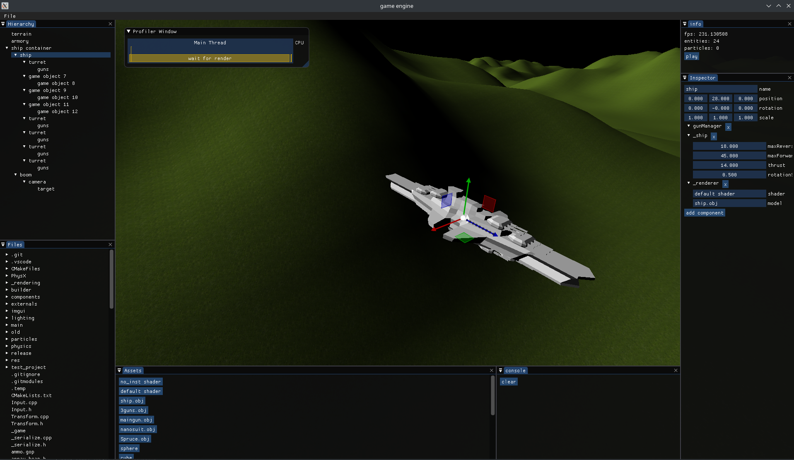
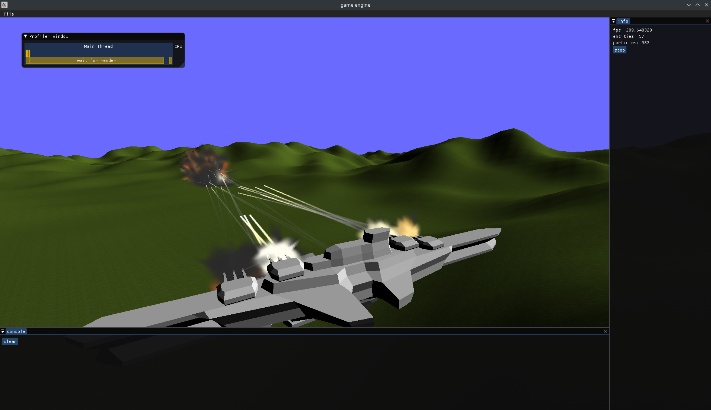

# C++ Game Engine
This project addresses game engine design from a perspective of increasing core counts in consumer CPUs and fully utilizing a desktops resources.
the projects developement was dropped in favor of the rust implementation
## features
 - massive parallelism utilizing TBB(Intel Threading Building Blocks) fork and join paradigm
 - particles are simulated and sorted on the GPU allowing for millions of particles globally sorted using compute shaders
 - objects are instanced by default for improved draw call performance
 - runtime compilation for user scripts
 - ECS/Data Oriented Desgin/behavior inheritance hybrid allows for easy and comfortable scripting experience with highly performant runtime


## Requirements
-  linux (arch or Debian(apt))
-  c++ compiler
-  make
-  cmake
-  vscode (build task)
## Build Steps
-  ```make getDeps``` or ```make getDebDeps```
-  use vscode "run and debug" release profile/press f5 in vscode
